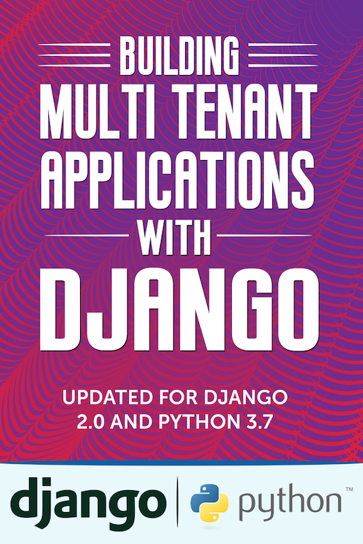

.. Building Multi Tenant Applications with Django documentation master file, created by
   sphinx-quickstart on Fri Jun  1 08:43:07 2018.
   You can adapt this file completely to your liking, but it should at least
   contain the root `toctree` directive.

Building Multi Tenant Applications with Django
==========================================================================

.. toctree::
   :maxdepth: 2
   :caption: Table of Contents:

   introduction
   shared-database-shared-schema
   shared-database-isolated-schema
   isolated-database
   isolated-dockers
   tying-it-all-together
   third-party-apps

Indices and tables
==================

* :ref:`genindex`
* :ref:`modindex`
* :ref:`search`
