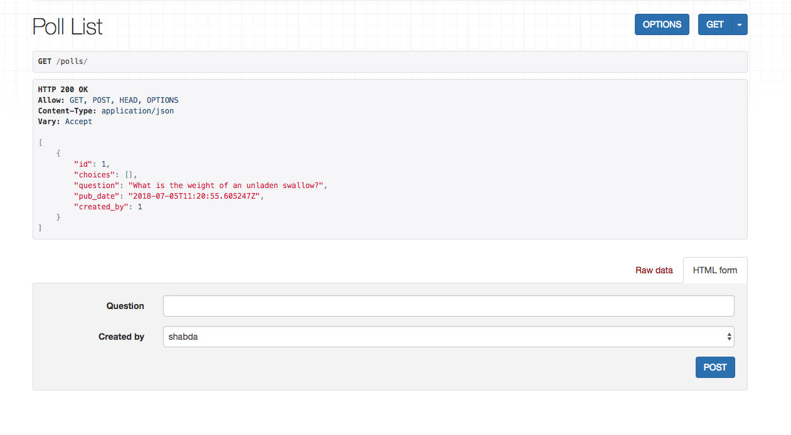

Isolated database with a shared app server
----------------------------------------------

In the previous chapter we used schemas to separate each tenant's data. In this chapter we will keep each tenant's data in a separate DB.
For this chapter we will use sqlite, though any DB supported by Django will suffice. Our core architecture will be quite similar to the previous chapter, where we

- Used request header to find the tenant
- Created a mapping of tenants to schemas
- Set the tenant specific schema in middleware

In this chapter, we will

- Use request header to find the tenant
- Create a mapping of tenants to databases
- Set the tenant specific database in middleware.

Let's get rolling.

Multiple database support in Django
+++++++++++++++++++++++++++++++++++++

Django has descent support for a multi DB apps. You can specify multiple databases in your settings like this.

.. code:: python

    DATABASES = {
        "default": {"ENGINE": "django.db.backends.sqlite3", "NAME": "default.db"},
        "thor": {"ENGINE": "django.db.backends.sqlite3", "NAME": "thor.db"},
        "potter": {"ENGINE": "django.db.backends.sqlite3", "NAME": "potter.db"},
    }

Then, if you want to read :code:`Polls` from the :code:`thor` db, you can use :code:`Poll.objects.using('thor').all()`.

This sort of works. But if we had to use :code:`using` everywhere, the code duplication would quickly make our code unmanageable.
We need a central place to define which database the tenant's DB requests should go to. Enter Django database routers.

Database routing in Django
+++++++++++++++++++++++++++++++++++++++++++++++++++++

Django allows hooking into the database routing process using the :code:`DATABASE_ROUTERS` settings.

:code:`DATABASE_ROUTERS` take a list of classes which must implement a few methods. A router class looks like this.

.. code:: python

    class CustomRouter:

        def db_for_read(self, model, **hints):
            return None

        def db_for_write(self, model, **hints):
            return None

        def allow_relation(self, obj1, obj2, **hints):
            return None

        def allow_migrate(self, db, app_label, model_name=None, **hints):
            return None

However, none of the methods in a Router class take request as an argument, which means there is no way for a router to call :code:`tenant_db_from_request`. So we will need a way to pass the tenant data to the router.

Per tenant database routing using middlewares
+++++++++++++++++++++++++++++++++++++++++++++++++++++

We will use a middleware to calculate the DB to use. We will also need some way to pass it to the router.
We are going to use a threadlocal variable to do this.

What are threadlocal variables?
=================================

Threadlocal variables are variables which you need to be accessible during the whole life-cycle of the thread, but you don't want it to be accessible or to leak between threads.
threadlocal variables are discouraged in Django but they are a clean way for us to pass the data down the stack to the routers.

You create a threadlocal variable at the top of the module like this :code:`_threadlocal = threading.local()`.

If you are using Python 3.7, you can also use contextvars instead of threadlocal variables.

The middleware class
=================================

With this discussion, our middleware class looks like this:

.. code-block:: python

    import threading

    from django.db import connections
    from .utils import tenant_db_from_request

    THREAD_LOCAL = threading.local()

    class TenantMiddleware:
        def __init__(self, get_response):
            self.get_response = get_response

        def __call__(self, request):
            db = tenant_db_from_request(request)
            setattr(THREAD_LOCAL, "DB", db)
            response = self.get_response(request)
            return response

    def get_current_db_name():
        return getattr(THREAD_LOCAL, "DB", None)

    def set_db_for_router(db):
        setattr(THREAD_LOCAL, "DB", db)

We have also added a few utility methods.

Now use these in your :code:`settings.py`.

.. code-block:: python

    MIDDLEWARE = [
        # ...
        "tenants.middlewares.TenantMiddleware",
    ]
    DATABASE_ROUTERS = ["tenants.router.TenantRouter"]

Outside the request response cycle
+++++++++++++++++++++++++++++++++++++++++++++++++++++

Our requests requests are now tenant aware, but we still need to run a few commands to finish our setup.

- We need to run migrations for all our databases
- We need to create a superuser to access the admin and create some objects

Most Django commands take a :code:`--database=db_name` option, to specify which DB to run the command against. We can run the migrations like this.

.. code-block:: bash

    python manage.py migrate --database=thor
    python manage.py migrate --database=potter

However not all commands are multi-db aware, so it worthwhile writing a :code:`tenant_context_manage.py`.

.. code-block:: python

    #!/usr/bin/env python
    import os
    import sys

    from tenants.middlewares import set_db_for_router

    if __name__ == "__main__":
        os.environ.setdefault("DJANGO_SETTINGS_MODULE", "pollsapi.settings")
        try:
            from django.core.management import execute_from_command_line
        except ImportError as exc:
            raise ImportError(
                "Couldn't import Django. Are you sure it's installed and "
                "available on your PYTHONPATH environment variable? Did you "
                "forget to activate a virtual environment?"
            ) from exc
        from django.db import connection

        args = sys.argv
        db = args[1]
        with connection.cursor() as cursor:
            set_db_for_router(db)
            del args[1]
            execute_from_command_line(args)

It is slightly modified version of manage.py which takes the dbname as the first argument. We can run like this.

.. code-block:: python

    python tenant_context_manage.py thor createsuperuser --database=thor

With this we can add some :code:`Poll` objects from the admin, and look at the API. It look like this.

In the next chapter, we will look at separating the tenants in their own docker containers. The code for this chapter is available at https://github.com/agiliq/building-multi-tenant-applications-with-django/tree/master/isolated-db
