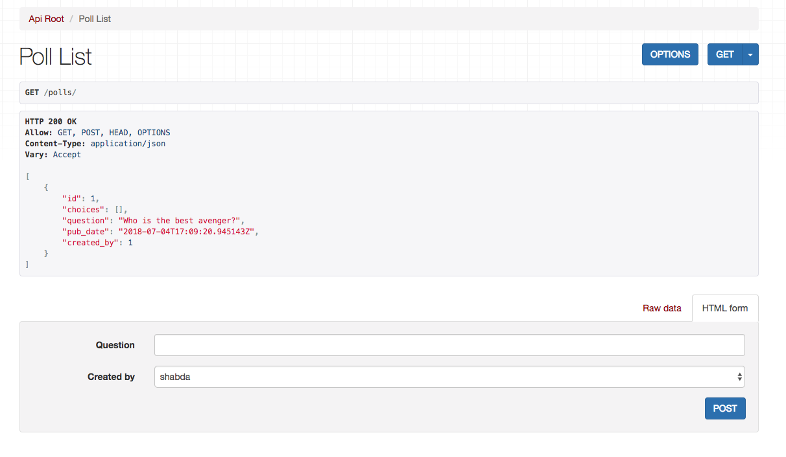

Shared database with isolated schema
---------------------------------------

Limitations of shared schema and our current method
++++++++++++++++++++++++++++++++++++++++++++++++++++++

In the previous chapter we used a :code:`ForeignKey` to separate the tenants. This method is simple
but limited due to the following:

- Weak separation of tenant's data
- Tenant isolation code is intermixed with app code
- Duplication of code

Weak separation of tenant's data
=================================

Because each tenant's data stays in the same schema, there is no way to limit access to a single tenant's data at the DB level.

Tenant isolation code is intermixed with app code
==================================================

You need to litter your code with :code:`.filter(tenant=tenant)` every time you access the database. For example in your :code:`ViewSet` you would be doing this:

.. code-block:: python

    def get_queryset(self):
        tenant = tenant_from_request(self.request)
        return super().get_queryset().filter(tenant=tenant)

If you even miss a :code:`filter`, you would be mixing data from two tenants. This will be a bad security bug.

Duplication of code
============================

The tenant separation code of getting the tenant from the request and filtering on it is all over your codebase, rather than a central location.

In this chapter, we will rearchitect our code to use Shared database with isolated schema, which will fix most of these limitations.

What are database schemas?
+++++++++++++++++++++++++++

Schemas in database are a way to group objects. Postgres documentation defines schema as

    A database contains one or more named schemas, which in turn contain tables. Schemas also contain other kinds of named objects, including data types, functions, and operators. The same object name can be used in different schemas without conflict; for example, both schema1 and myschema may contain tables named mytable.

For the rest of the chapter, we will be using Postgres. We will be using one schema per tenant.

We need some way to keeping a mapping on tenants to schemas. There are a number of ways you could do it, for example by keeping a table in public schema to map tenant urls to schemas. In this chapter, for simplicity,  we will keep a simple map of tenant urls to schemas.

Add this to your utils.py

.. code-block:: python

    def get_tenants_map():
        return {
            "thor.polls.local": "thor",
            "potter.polls.local": "potter",
        }

Now when we get a request to :code:`thor.polls.local` we need to read from the schema :code:`thor`, and when we get a request to :code:`potter.polls.local` we need to read from schema :code:`potter`.

Managing database migrations
++++++++++++++++++++++++++++

:code:`manage.py migrate` is not schema aware. So we will need to subclass this command so that tables are created in all the schemas. Create the folder structure for a new command following the usual `django convention <https://docs.djangoproject.com/en/2.0/howto/custom-management-commands/>`_. Then add a file named :code:`migrate_schemas` in there.

.. code-block:: python

    from django.core.management.commands.migrate import Command as MigrationCommand

    from django.db import connection
    from ...utils import get_tenants_map

    class Command(MigrationCommand):
        def handle(self, *args, **options):
            with connection.cursor() as cursor:
                schemas = get_tenants_map().values()
                for schema in schemas:
                    cursor.execute(f"CREATE SCHEMA IF NOT EXISTS {schema}")
                    cursor.execute(f"SET search_path to {schema}")
                    super(Command, self).handle(*args, **options)

To understand what we are doing here, you need to know a few Postgres queries.

- :code:`CREATE SCHEMA IF NOT EXISTS potter` creates a new schema named potter.
- :code:`SET search_path to potter` set the connection to use the given schema.

Now when you run :code:`manage.py migrate_schemas` it loops over the our tenants map, then creates a schema for that tenant and runs the migration for the tenant.

Tenant separation in views
++++++++++++++++++++++++++++

Lets add a few utility methods which will allow us to get and set the schema. Add the following functions to your :code:`utils.py`.

.. code-block:: python

    def hostname_from_request(request):
        # split on `:` to remove port
        return request.get_host().split(':')[0].lower()

    def tenant_schema_from_request(request):
        hostname = hostname_from_request(request)
        tenants_map = get_tenants_map()
        return tenants_map.get(hostname)

    def set_tenant_schema_for_request(request):
        schema = tenant_schema_from_request(request)
        with connection.cursor() as cursor:
            cursor.execute(f"SET search_path to {schema}")

Now we can separate the tenants in the views using these functions.

.. code-block:: python

    # apiviews.py
    # ...
    from tenants.utils import set_tenant_schema_for_request

    class PollViewSet(viewsets.ModelViewSet):
        queryset = Poll.objects.all()
        serializer_class = PollSerializer

        def get_queryset(self):
            set_tenant_schema_for_request(self.request)
            tenant = tenant_from_request(self.request)
            return super().get_queryset().filter(tenant=tenant)

        def destroy(self, request, *args, **kwargs):
            set_tenant_schema_for_request(self.request)
            poll = Poll.objects.get(pk=self.kwargs["pk"])
            if not request.user == poll.created_by:
                raise PermissionDenied("You can not delete this poll.")
            return super().destroy(request, *args, **kwargs)

    # ...

.. code-block:: python

    # admin.py
    # ...
    from tenants.utils import tenant_schema_from_request

    @admin.register(Poll)
    class PollAdmin(admin.ModelAdmin):
        fields = ["question", "created_by", "pub_date"]
        readonly_fields = ["pub_date"]

        def get_queryset(self, request, *args, **kwargs):
            set_tenant_schema_for_request(self.request)
            queryset = super().get_queryset(request, *args, **kwargs)
            tenant = tenant_from_request(request)
            queryset = queryset.filter(tenant=tenant)
            return queryset

        def save_model(self, request, obj, form, change):
            set_tenant_schema_for_request(self.request)
            tenant = tenant_from_request(request)
            obj.tenant = tenant
            super().save_model(request, obj, form, change)

A middleware to set schemas
++++++++++++++++++++++++++++

Our naive approach to separate the tenants suffers from a few problems:

- :code:`set_tenant_schema_for_request(self.request)` is duplicated everywhere
- Any third party code, including Django's, ORM accesses will fail because they will try to access the objects from the public schema, which is empty.

Both of these can be fixed by using a middleware.
We will set the schema in the middleware before any view code comes in play, so any ORM code will pull and write the data from the tenant's schema.

Create a new middleware like this:

.. code-block:: python

    from tenants.utils import set_tenant_schema_for_request

    class TenantMiddleware:
        def __init__(self, get_response):
            self.get_response = get_response

        def __call__(self, request):
            set_tenant_schema_for_request(request)
            response = self.get_response(request)
            return response

And add it to your :code:`settings.MIDDLEWARES`

.. code-block:: python

    MIDDLEWARE = [
        # ...
        'tenants.middlewares.TenantMiddleware',
    ]

Beyond the request-response cycle
++++++++++++++++++++++++++++++++++++++++++++++++++++++++

We have one more change to make before we are done. You can not use `manage.py createssuperuser` or any Django command, as manage.py will try to use the public schema, and there are no tables in the public schema.

Middleware is only used in the request-response cycle and does not come into play when you run a command.
Therefore we need another place to hook our :code:`set_tenant_schema_for_request`.
To do this, create a new file :code:`tenant_context_manage.py`. This is similar to :code:`manage.py`, with a few minor changes.

.. code-block:: python

    #!/usr/bin/env python
    import os
    import sys

    if __name__ == "__main__":
        os.environ.setdefault("DJANGO_SETTINGS_MODULE", "pollsapi.settings")
        try:
            from django.core.management import execute_from_command_line
        except ImportError as exc:
            raise ImportError(
                "Couldn't import Django. Are you sure it's installed and "
                "available on your PYTHONPATH environment variable? Did you "
                "forget to activate a virtual environment?"
            ) from exc
        from django.db import connection
        args = sys.argv
        schema = args[1]
        with connection.cursor() as cursor:

            cursor.execute(f"SET search_path to {schema}")

            del args[1]
            execute_from_command_line(args)

This allows setting the tenant schema, which is passed as first argument before running the command.

We will be able to use it like this. :code:`python tenant_context_manage.py thor createsuperuser`.

With this, you can login to any tenant's admin, create some objects, and view the API endpoints. Here is what the polls api endpoint looks like for me.

In the next chapter we will look at separating the tenants to their own databases.

The code for this chapter is available at https://github.com/agiliq/building-multi-tenant-applications-with-django/tree/master/isolated-schema
